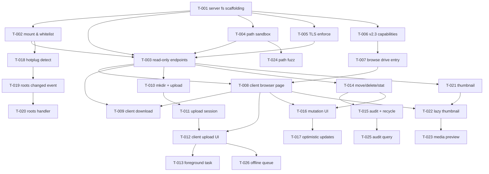

# LocalU 实施工单总览

> 关联文档：[`../REQUIREMENTS.md`](../REQUIREMENTS.md) — 需求规格说明书
> 关联原型：[`../../localU.ini`](../../localU.ini)
> 关联项目：[`../`](../) — Flutter + Rust monorepo

本目录是 LocalU（局域网「挂载端 + 移动端」文件管理服务）的**可实施工单集合**，按 Phase 分目录，每张工单一个独立 MD 文件，可作为代码实施的直接输入。

---

## 目录结构

```
tickets/
├── README.md                       # 本文件（总览）
├── P1-mvp/                         # Phase 1：只读 MVP
│   ├── T-001-server-fs-scaffolding.md
│   ├── T-002-mount-points-and-whitelist.md
│   ├── T-003-server-read-only-endpoints.md
│   ├── T-004-server-path-safety-sandbox.md
│   ├── T-005-server-tls-enforcement.md
│   ├── T-006-protocol-v2.3-capabilities.md
│   ├── T-007-client-browse-drive-entry.md
│   ├── T-008-client-file-browser-page.md
│   └── T-009-client-download-to-local.md
├── P2-write/                       # Phase 2：写入能力
│   ├── T-010-server-mkdir-upload.md
│   ├── T-011-server-upload-session.md
│   ├── T-012-client-upload-ui.md
│   └── T-013-client-ios-foreground-task.md
├── P3-crud/                        # Phase 3：完整 CRUD
│   ├── T-014-server-move-delete-stat.md
│   ├── T-015-server-audit-recycle.md
│   ├── T-016-client-mutation-ui.md
│   └── T-017-client-optimistic-updates.md
├── P4-hotplug/                     # Phase 4：热插拔
│   ├── T-018-server-hotplug-detection.md
│   ├── T-019-server-roots-changed-event.md
│   └── T-020-client-roots-handler.md
├── P5-media/                       # Phase 5：媒体优化
│   ├── T-021-server-thumbnail.md
│   ├── T-022-client-lazy-thumbnail-pagination.md
│   └── T-023-client-media-preview.md
└── P6-hardening/                   # Phase 6：安全与可靠性
    ├── T-024-server-path-fuzz.md
    ├── T-025-server-audit-persistence.md
    └── T-026-client-offline-queue.md
```

## Phase 路线图

| Phase     | 范围                                                                                                    | 工单数 | 累计估时  | 累计代码量（估） |
|-----------|---------------------------------------------------------------------------------------------------------|--------|-----------|------------------|
| **P1 MVP** | 挂载点枚举 + 白名单 + 路径沙箱 + TLS 强制 + v2.3 协议 + 移动端只读浏览 + 下载                          | 9      | 17 d      | ~3 500 行        |
| **P2**     | mkdir / 流式上传 / 后台保活                                                                              | 4      | 10 d      | ~2 000 行        |
| **P3**     | move / delete / stat / 平台回收站 / 写审计 / 客户端 CRUD UI / 乐观更新                                  | 4      | 8 d       | ~2 200 行        |
| **P4**     | 跨平台热插拔 + 推送事件 + roots 变化处理                                                                | 3      | 5.5 d     | ~1 200 行        |
| **P5**     | 服务端缩略图 + 客户端懒加载 + 媒体预览                                                                  | 3      | 8 d       | ~1 800 行        |
| **P6**     | 路径 fuzz + 审计查询 UI + 离线队列持久化                                                                 | 3      | 5 d       | ~1 200 行        |
| **总计**    |                                                                                                          | **26** | **~53.5 d** | **~11 900 行**  |

> "累计估时"为单人 1 人月工作量的近似估算，实际视团队规模并行调整。

## 依赖图



## 实施建议

### 团队拆分（参考）

- **1 人全栈**：按 Phase 顺序串行，约 11 周
- **2 人**：Server (T-001~T-006, T-010~T-011, T-014~T-015, T-018~T-019, T-021, T-024~T-025) + Client (T-007~T-009, T-012~T-013, T-016~T-017, T-020, T-022~T-023, T-026)
- **3 人**：再拆 Fuzz / 性能专项 + 协议 PR

### 每个工单开工前

1. 通读 §1~§5（背景 / 目标 / 范围 / 文件 / 设计）
2. 与 `REQUIREMENTS.md` 对应章节交叉校对
3. 拉分支：`git checkout -b feat/T-NNN-short-name`
4. 实施：先 §7 单测通过 → 集成 → §8 验收
5. 提交：单测 + format + analyze + `cargo test --features full`

### 跨工单约束

- **T-001 必须先做**（脚手架是后续所有工单的依赖）
- **T-004 + T-005** 是安全基础，所有 server 写端点必须等它们完成
- **T-006** 是协议 PR，需在 v2.3 协议 PR 合并到 `https://github.com/localsend/protocol` 后再合入
- **T-021** 单独 feature 化（`feature = ["fs-thumb"]`），便于 release 节奏控制

## 与现有 AGENTS.md / CLAUDE.md 的对齐

- 所有命令使用 `fvm flutter` / `fvm dart`，不裸用
- `packages/core` 改动必须 `cargo test --features full`
- 150 列 format（不要让 FRB / mockito 改回 80 列）
- 生成代码不进 review（FRB 输出在 `lib/rust` / `lib/gen`）
- F-Droid Reproducible Builds：`build.yaml` 中 `timestamp: false` 不动
- 跨平台 CI 必跑：macOS / Windows / Linux 三 runner
- 版本号同步：`app/pubspec.yaml` / `cli/Cargo.toml` / `support/scripts/compile_windows_exe-inno.iss` / `support/build/appimage/*.yml` / `support/build/msix/content/AppxManifest.xml`

## 下一步

技术方案文档 `TECHNICAL_DESIGN.md` 应在 P1 开工前完成，包含：

- Rust 侧 `fs` 模块文件树
- FRB 绑定清单
- isolate action 清单
- UI 页面树
- 状态机（发现 / 连接 / 浏览 / 上传 / 断点续传）
- 风险复核
